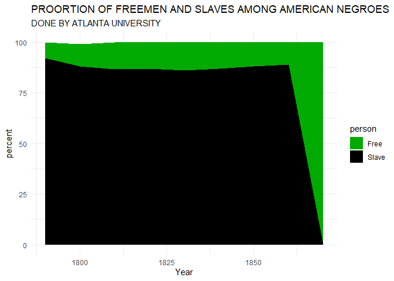

du\_bois
================
ofchurches
23 February 2021

# Get the package

# Get the data

``` r
freed_slaves <- readr::read_csv('https://raw.githubusercontent.com/rfordatascience/tidytuesday/master/data/2021/2021-02-16/freed_slaves.csv')
```

    ## Parsed with column specification:
    ## cols(
    ##   Year = col_double(),
    ##   Slave = col_double(),
    ##   Free = col_double()
    ## )

# Design intent

I'm thinking of re-creating this:


I guess its a stacked area chart?

# Shaping

But, the `freed_slaves` data isn't tidy. There are two colums of numeric data for the levels of the factor rather than a factor with the level and a factor with the numeric value.

``` r
freed_slaves_tidy <- freed_slaves %>%
  pivot_longer(cols = !Year, 
               names_to = "person",
               values_to = "percent")
```

# Ploting

``` r
freed_slaves_tidy %>%
  ggplot(aes(x = Year, y = percent, fill = person)) + 
    geom_area()
```


# Checks

At 1800 it look like there are less than 100%. This is worth a check:

``` r
freed_slaves %>%
  rowwise() %>%
  mutate(sum = sum(Slave, Free)) %>%
  kable()
```

|  Year|  Slave|   Free|  sum|
|-----:|------:|------:|----:|
|  1790|   92.0|    8.0|  100|
|  1800|   88.0|   11.0|   99|
|  1810|   86.5|   13.5|  100|
|  1820|   87.0|   13.0|  100|
|  1830|   86.0|   14.0|  100|
|  1840|   87.0|   13.0|  100|
|  1850|   88.0|   12.0|  100|
|  1860|   89.0|   11.0|  100|
|  1870|    0.0|  100.0|  100|

But that's the data so I'm going to leave it as is.

# Aesthetics

Time to set the colours and add the text.

``` r
freed_slaves_tidy %>%
  ggplot(aes(x = Year, y = percent, fill = person)) + 
  geom_area() +
  scale_fill_manual(values=c("#00aa00", "#000000")) + 
  theme_minimal() + 
  labs(title = "PROORTION OF FREEMEN AND SLAVES AMONG AMERICAN NEGROES", 
       subtitle ="DONE BY ATLANTA UNIVERSITY")
```


