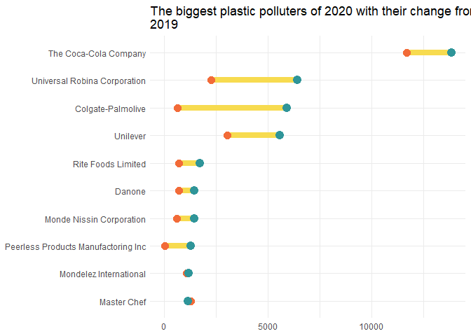
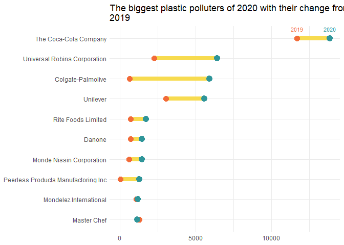

plastic\_pollution
================
ofchurches
2 February 2021

# Background

The read.me with instructions, notes, data and data-dictionary is [here](https://github.com/rfordatascience/tidytuesday/blob/master/data/2021/2021-01-26/readme.md).

# Get the data

``` r
plastics <- readr::read_csv('https://raw.githubusercontent.com/rfordatascience/tidytuesday/master/data/2021/2021-01-26/plastics.csv')
```

# Design thoughts

It looks like there are two years for each `parent_company`. That makes me think about doing a dumbell plot. These are used by FiveThirtyEight quite a bit:


The idea would be to look at the change from 2019 to 2020 of each `parent_company` in the `grand_total` amount of plastics.

# Get the packages

It seems that we'll need the `tidyverse` and there is a `geom_dumbell()` in the `ggalt` package. So, lets get them.

``` r
library(tidyverse)
library(ggalt)
```

# Cleaning

My thoughts on cleaning are that:

1.  It seems unlikely that there will be a `parent_company` with a `grand_total` of 0.
2.  I don't want to analyse a `parent_company` called "Grand Total", "null", "NULL" or "Unbranded"

``` r
clean_plastics <- plastics %>%
  filter(is.na(grand_total) == 0) %>%
  filter(!parent_company %in% c("Grand Total", "null", "NULL", "Unbranded"))
```

# Calculate values

Because I'm not interested in the `country` for this analysis, I'll have to agregate all the values for `grand_total` within each `parent_company` and `year`.

``` r
aggregated_plastics <- clean_plastics %>%
  group_by(year, parent_company) %>%
  summarise(sum_grand_total = sum(grand_total)) %>%
  ungroup()
```

    ## `summarise()` regrouping output by 'year' (override with `.groups` argument)

# Reshape

Now here's a funny thing for a *TidyTuesday* analysis...it turns out that `ggalt::geom_dumbbell()` needs two numeric variables - which contravenes tidy principles:

1.  Each variable forms a column.

2.  Each observation forms a row.

3.  Each type of observational unit forms a table.

> > <https://cran.r-project.org/web/packages/tidyr/vignettes/tidy-data.html>

But needs must...

Something that is cool about `pivot_longer()` that I learnt today from Lan Kelly is that you can specify a "prefix" for the newly created variable names. This is important in this case because I'm creating variable names that are numeric and that's always a bit risky in any language.

``` r
shaped_plastics <- aggregated_plastics %>%
    pivot_wider(names_from = year, values_from = sum_grand_total,  names_prefix = "year_")
```

# Second clean up

Now, because some companies didn't have any record for one year, there are a lot of `NA` values created in the two `year_` varaibles. If I thought that because they weren't included that meant there was 0 plastics in that year then I could have used `values_fill = 0`. But I don;t think that! Equating *missing* with *0* is suuuuuper risky. So, I'm going to remove those companies.

Also, I only want the companies with the highest `sum_grand_total` of 2020 to plot.

``` r
clean_shaped_plastics <- shaped_plastics %>%
  filter(is.na(year_2019) == 0) %>%
  filter(is.na(year_2020) == 0) %>%
  slice_max(order_by = year_2020, n = 10)
```

# Plot

And at last, I have data that is in a shape to plot!

I think this will look nicer if the data are ordered too.

And I've used the three part colour scheme [here](https://digitalsynopsis.com/design/minimal-web-color-palettes-combination-hex-code/) as an inspiration.

``` r
plot_plastics <- clean_shaped_plastics %>%
  ggplot(aes(y= reorder(parent_company, year_2020), x=year_2019, xend=year_2020)) +
  geom_dumbbell(size=3, color="#F7DB4F",
                colour_x = "#F26B38", colour_xend = "#2F9599",
                dot_guide=FALSE, dot_guide_size=0.25, show.legend = TRUE) +
  labs(x=NULL, y=NULL, title=str_wrap("The biggest plastic polluters of 2020 with their change from 2019", width = 60)) +
  theme_minimal()

plot_plastics
```



That looks mostly like what I had in mind.

There's just one thing...without a legend to explain which year is which its less informative than I might hope! There is an elegant solution to this [here](https://towardsdatascience.com/create-dumbbell-plots-to-visualize-group-differences-in-r-3536b7d0a19a)

``` r
plot_plastics +
  geom_text(data=filter(clean_shaped_plastics, parent_company=="The Coca-Cola Company"),
          aes(x=year_2019, y=parent_company, label="2019"),
          color="#F26B38", size=3, vjust=-1.5) +
  geom_text(data=filter(clean_shaped_plastics, parent_company=="The Coca-Cola Company"),
          aes(x=year_2020, y=parent_company, label="2020"),
          color="#2F9599", size=3, vjust=-1.5)
```


